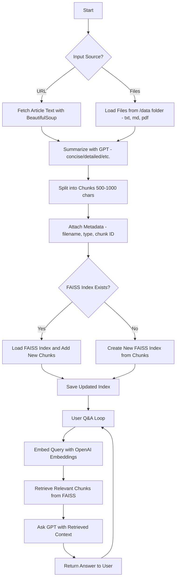

# Smart Chatbot (Summarizer → RAG)  
# **Part 4 — Multi-File Support + Chunking**  

## 🎯 Goal  
Load one or more files or a URL.  
**Features**:  
1. **Load multiple local files** (`.pdf`, `.txt`, `.md`) from a folder.  
2. **Chunk the text** into 500–1000 character segments.  
3. **Store chunks in FAISS** with metadata (file name, file type, source path, etc.).  
4. **Prepare them for RAG (Retrieval-Augmented Generation)**.  
---
## 🧠 Concepts  
- **Multi-file ingestion** → Instead of just one file, the script can load and process multiple file types (`.txt`, `.md`, `.pdf`) from your `data/` folder.  
- **Chunk metadata** → Store filename, file type, and chunk ID so you know where each answer came from.  
- **Reusable pipeline** → Drop any file into `data/`, and it will automatically be split, embedded, and made queryable.  
📚 Docs you might want later:  
- [LangChain loaders](https://python.langchain.com/docs/modules/data_connection/document_loaders/)  
- [LangChain text splitters](https://python.langchain.com/docs/modules/data_connection/text_splitters/)  

## 📊 System Flow (Summarizer → RAG)

