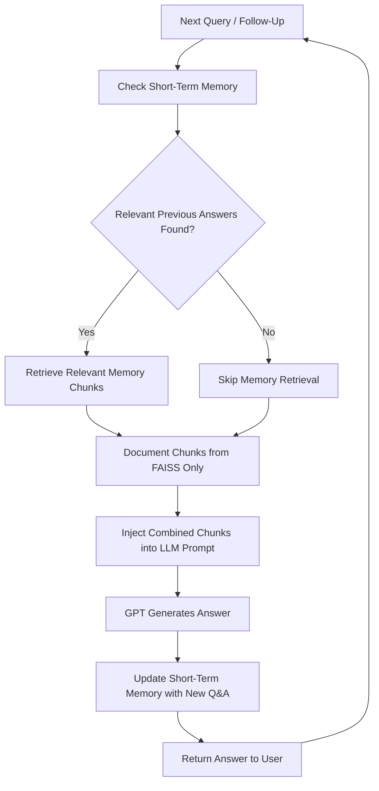

# Smart Chatbot(Summarizer -> RAG)
## Step 6 — Chat Memory & Follow-Ups

### Goal
Enhance RAG chatbot with **conversational memory**, allowing it to remember previous Q&A within a session and handle follow-up questions.

### 🛠 Tasks
1. **Add Conversational Memory**
   - Store previous questions and answers in a **short-term buffer**.
2. **Re-Embed Relevant Context**
   - When a new query is asked, retrieve relevant previous answers and include them in the RAG search.
3. **Integration**
   - Combine the new memory with existing document chunks for retrieval-augmented generation.

### ✅ Outcome
Your chatbot becomes **contextual**:
- Supports follow-up questions.  
- Maintains continuity in a conversation.  
- Gives answers informed by both documents and prior interactions.

### 📚 Resources
- [LangChain Memory Documentation](https://python.langchain.com/docs/modules/memory/) – Learn how to implement conversational memory in LangChain.  
- [FAISS Documentation](https://faiss.ai/) – Efficient similarity search for embeddings.  
- [OpenAI Embeddings](https://platform.openai.com/docs/guides/embeddings) – How to create embeddings for queries and documents.  
- [Retrieval-Augmented Generation (RAG) Guide](https://www.pinecone.io/learn/rag/) – Conceptual overview of RAG pipelines.  
- [LangChain Examples](https://github.com/hwchase17/langchain) – Real-world examples of memory + RAG integration.

