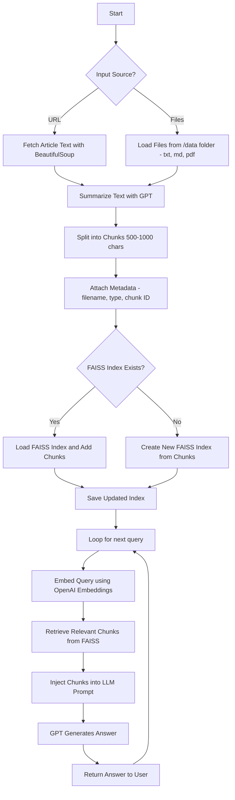

# Smart Chatbot(Summarizer -> RAG)
## End-to-End RAG Pipeline

###  Goal
Build a pipeline where your bot can:

1. Load multiple file types (`.txt`, `.md`, `.pdf`) from a folder or fetch articles from a URL.  
2. Chunk documents into manageable pieces.  
3. Store chunks in **FAISS** with metadata.  
4. Answer user questions using **retrieval-augmented generation (RAG)**.

### Steps
1. **Load Documents**  
   - From `/data` folder or a URL.
2. **Summarize & Chunk**  
   - Split text into 500–1000 character chunks.  
   - Attach metadata (filename, type, chunk ID).
3. **Store in FAISS**  
   - Create or update FAISS vector store.
4. **User Query / RAG**  
   - Embed the query using OpenAI Embeddings.  
   - Retrieve top-k relevant chunks from FAISS.  
   - Inject chunks into LLM prompt.
5. **Generate Answer**  
   - GPT generates answer based strictly on retrieved context.
   
### ✅ Outcome
Users can ask questions and receive **context-aware answers** sourced from multiple documents, rather than relying on raw memory alone.

